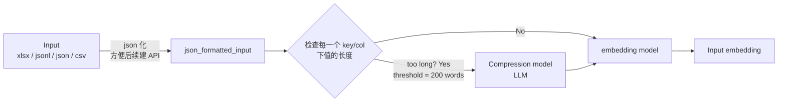
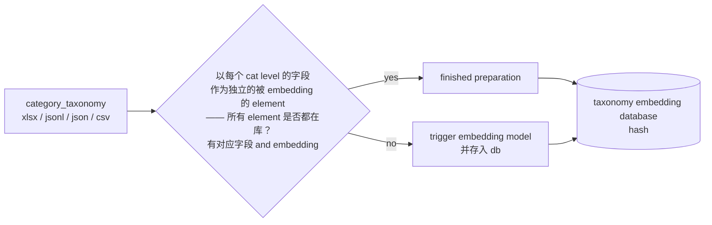
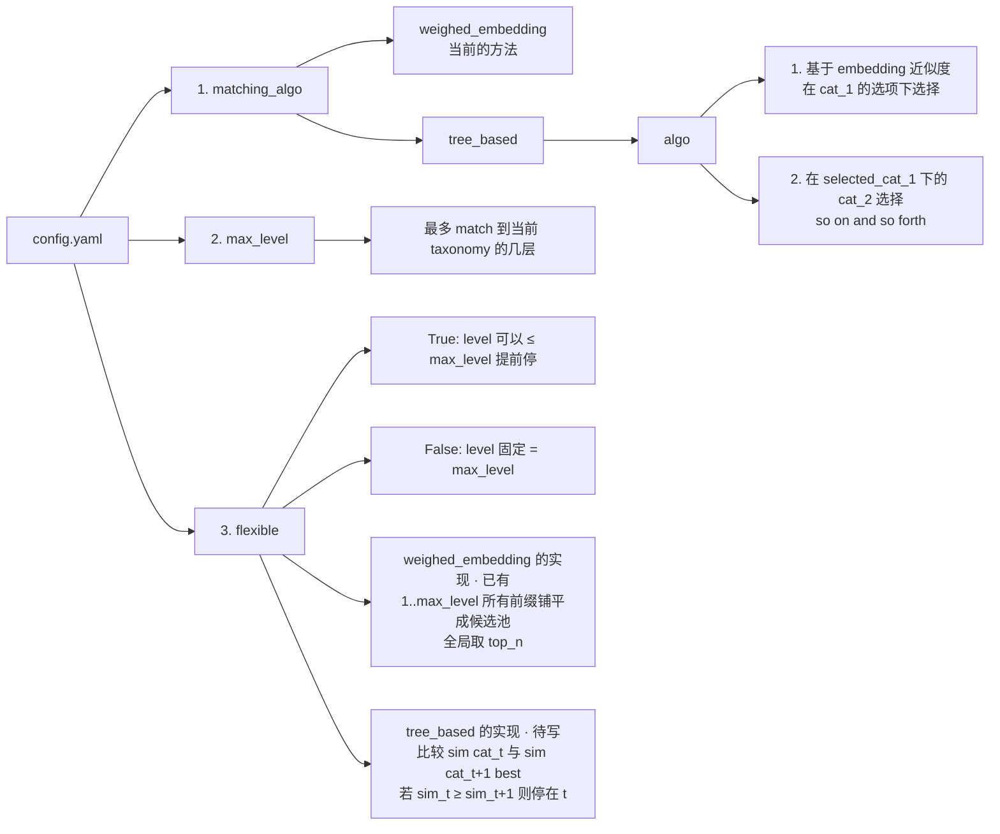
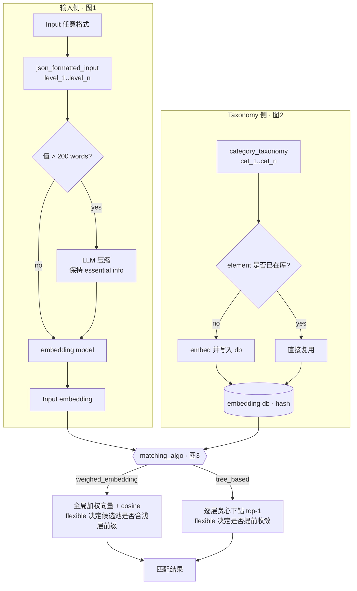

# 匹配流水线改造构想（三张手绘图的解析 + 第一轮确认）

> 本文是对三张构想图的**结构化转写**，并已合入作者第一轮答复（2026-09-04）。
> 图1 = 输入侧处理，图2 = taxonomy 侧准备，图3 = 新 `config.yaml` 契约。
> 「❓」= 仍待确认；「✅」= 已确认的决定。

## 已确认的五条决定（第一轮）

| # | 决定 |
|---|---|
| ✅ 1 | **翻译功能整体去掉**。工具只支持英文数据，README / config 注释里必须明确写出「English only」。`tools/trans.py`、`trans_*` 配置项、`cache/*translation*.joblib` 一并退休。 |
| ✅ 2 | 输入侧 `level_*` 与 taxonomy 侧 `cat_*` **保持区分**（两类文件不混淆），但二者本质都是**层级结构**；实际形态参考 [data/taxonomy.xlsx](data/taxonomy.xlsx)。 |
| ✅ 3 | **`sku_name` 不再是特例**，它就抽象成输入的最后一个 level（`level_n`）。`consider_sku_name` / `sku_cate_num` 一并去掉。 |
| ✅ 4 | `tree_based` **用纯贪心**：每层只选相似度最高的一个节点往下走，不做 beam search。 |
| ✅ 5 | 图3 里 `algo` 下面那个 `flexible` **不是第二个配置项**，只是在解释 flexible 在 tree_based 下怎么执行。`flexible` 是**一个** key，两种算法各自有自己的实现 —— 现有代码已经有 `weighed_embedding` 的 flexible（[main.py:231-271](main.py#L231-L271)），**缺的是 tree_based 的 flexible**。 |

## 已确认的四条决定（第二轮）

| # | 决定 |
|---|---|
| ✅ 6 | taxonomy 字段名以图为准：**`cat_1`、`cat_2`、…、`cat_n`**（不是 `cate_*`）。现有 [data/taxonomy.xlsx](data/taxonomy.xlsx) 的 `cate_1..cate_7` 需要改名，或在读取层做一次归一。 |
| ✅ 7 | 压缩走 **LLM**，且要**可配置**：`api_key` / `base_url` / `model_name` / `temperature`。前提是这个 repo 之后要写成一个 **module + API**，所以 config 得按「一段配置对应一个可注入的组件」来设计，见 [§4 config 草案](#4-configyaml-草案)。 |
| ✅ 8 | `tree_based` 每层比相似度时，input 侧用的是**整条输入合成的那一个 input embedding**（不是逐层拿 `level_t` 去比 `cat_t`）。即 `sim(cat_t, input)` 里的 `input` 全程不变，只有候选集在逐层收窄。 |
| ✅ 9 | **`top_n` 去掉**。两种算法都只输出一个最佳结果。`weighed_embedding` 的 flexible 模式相应改成全局 top-1。 |

## 已确认的五条决定（第三轮）

| # | 决定 |
|---|---|
| ✅ 10 | LLM 的连接参数（`api_key` / `base_url` / `model`）**全部从 `.env` 读**，不进 `config.yaml`。作者已在 [.env](.env) 里写好这三个键。代码侧封装成一个 **config 类**（dataclass），方便 module 化后直接引用/注入，见 [§4](#4-配置设计)。 |
| ✅ 11 | embedding 库用 **sqlite**（不用 joblib）。 |
| ✅ 12 | 这一轮**只重构成可 `import` 的 module**，FastAPI 留到下一轮（但数据形态先按 JSON 定好，接口不用返工）。 |
| ✅ 13 | tree_based **不输出每层的 sim 轨迹** —— 最终结果本身就是 `cat_1`、`cat_2`… 这样一路展开的路径，已经说明了一切。 |
| ✅ 14 | 现有 [data/taxonomy.xlsx](data/taxonomy.xlsx) **直接改文件**，把 `cate_1..cate_7` 改成 `cat_1..cat_7`；读取层不做兼容归一。 |

## 已确认的四条决定（第四轮）

| # | 决定 |
|---|---|
| ✅ 15 | **压缩结果不缓存**。sqlite 里只存 taxonomy 的 embedding，别的什么都不存。 |
| ✅ 16 | 长度检查就用 **`str.split()` 空格计数**。 |
| ✅ 17 | **输入侧的 embedding 不入库**，每次现算。库是 taxonomy 专用的。 |
| ✅ 18 | 包名由我定：**`catmatch`**（`from catmatch import Matcher, Config`）—— repo 名 `product_category_match` 太长，不适合天天 import。见 [§5](#5-module-形态)。 |
| ✅ 19 | 输出**保留 `match_level` 列**（见 [§3.5](#35-输出格式)）。 |
| ✅ 20 | 施工在新分支 **`refactor/catmatch-module`** 上进行，**不动 `main`**。 |

## 第五轮：tree_based 改成 beam search（推翻决定 4）

| # | 决定 |
|---|---|
| ✅ 21 | **tree_based 不再是纯贪心**（决定 4 作废）。新增 `beam_width`：每层保留 `beam_width` 个候选，候选不足就取当前全部；某个节点没有下一层就地终止（该路径仍留在候选池里）。走完之后候选池里有多条路径，**再用 weighed_embedding 的方式（整条路径加权合成一个向量）从中选最佳**。 |

**为什么改**：纯贪心第一层选错就再也救不回来 —— 样例里 "Nonstick Frying Pan 28cm" 第一层被判进 `Furniture`，后面全废。beam 保留多条线，最后统一用加权向量重排。样例上的效果（20 行，max_level=3）：

| beam_width | flexible=true 平均 sim | 与 weighed 全局最优一致 |
|---|---|---|
| 1 | 0.7341 | 14/20 |
| 3 | 0.7732 | 17/20 |
| 5 | 0.7737 | 18/20 |
| 10 | 0.7737 | 18/20 |

beam=3 已经吃掉大部分收益，5 以后基本饱和；那口平底锅在 beam≥3 时正确落到 `Home & Garden > Kitchen & Dining > Cookware & Bakeware`。默认值取 **3**。

**flexible 在新算法下的含义**（原「sim 不再上升就停」的逐层判据随之作废，深度改由最后那次加权重排决定）：

- `flexible: false` → 候选池只收**走到 `max_level` 的路径** + 中途触底的叶子（它们没法更深）。
- `flexible: true` → 候选池收**每一层 beam 里的所有路径**，浅层前缀也参与最后的重排。

`beam_width` 只对 tree_based 生效；`beam_width: 1` 不等于旧的纯贪心 —— 下钻过程一样，但最终仍会在「沿途各层前缀」里用加权方式重排。

---

## 图 1 · 输入侧：Input → Input embedding



### 1.1 输入格式契约

- **文件格式不限**：xlsx、jsonl、json、csv 都可以，读进来统一转成 JSON（「json 化」），目的是**方便后续包装成 API**。
- **字段命名固定**：key / column 必须是 `level_1`、`level_2`、…、`level_n`，层级由后缀数字决定。
- 图上例子：

```json
[{"level_1": "food", "level_2": "healthy yogurt"}]
```

- ✅ 原来的 `file_cols`（用户手报列名 + 「sku_name 必须放最后」的隐式规则）**取消**，改为约定优于配置。原 `sku_name` 就是最后一个 `level_n`（决定 3），所以「最后一层可以是非分类文本」变成**默认允许**，不再需要开关。
- ✅ **English only** —— 输入非英文不再有翻译兜底，文档需显式声明。

### 1.2 中间产物 `json_formatted_input`

统一后的数据形态，是后面所有步骤的唯一输入。图上把它单独画成一个 box，说明它是一个**明确的中间层**，不是内存里顺手转一下 —— 这一层就是未来 API 的 request body 形状。

### 1.3 长度检查 + 压缩（新增环节）

- 对**每一个 key/col 下的值**逐个检查长度。
- 阈值：**200 words**（图上标注 `threshold, 200 words`）。
- **超长 → 送进 Compression model（LLM）压缩**，硬约束写在图上方：
  > **do not change the essential info (what it is)**

  压缩只能删冗余修饰，不能改变「这个东西到底是什么」。
- **不超长 → 直接进 embedding model**，图下方注解「就用当前的 weighed embedding」，即短文本走现有路径不变。
- ✅ 因为翻译砍掉了，这条链上唯一的 LLM 调用就是压缩。
- ✅ 决定 7 + 10：压缩模型不写死。连接参数（`api_key` / `base_url` / `model`）从 [.env](.env) 读，行为参数（`temperature` / 阈值 / 重试）在 `config.yaml`，两边由 `LLMConfig` 合流（[§4.3](#43-config-类configpy-草案)）。协议是 OpenAI 兼容 —— 原 `tools/trans.py` 的 Qwen client 正好是这个形状，可以改造成通用 LLM client 复用，把「翻译 prompt」换成「压缩 prompt」即可。

- ✅ 决定 16：长度就用 **`len(text.split())`** 数（空格切词）。
- ✅ 决定 15：**压缩结果不缓存**，每次现压。sqlite 只服务 taxonomy embedding。

### 1.4 输出

`Input embedding` —— 输入侧的向量表示，交给匹配算法。

---

## 图 2 · Taxonomy 侧：category_taxonomy → embedding 数据库



### 2.1 taxonomy 格式契约

- 文件格式同样不限，字段固定为 `cat_1`、`cat_2`、…、`cat_n`（图上原文）。
- 图上例子：

```json
[{"cat_1": "food", "cat_2": "diary"}]
```

- ✅ 与输入侧的 `level_*` **有意区分**，但两者都是层级结构，处理逻辑同构。
- ✅ 决定 6 + 14：**以 `cat_*` 为准**，现有 [data/taxonomy.xlsx](data/taxonomy.xlsx) 的 `cate_1..cate_7` **直接改文件**改成 `cat_1..cat_7`。读取层不做 `cate_N → cat_N` 的兼容归一：契约就是契约，不合规就报错。

### 2.2 真实 taxonomy 的形态（来自 data/taxonomy.xlsx）

5595 行 × 7 层（Google product taxonomy 风格），**深度参差不齐**，每个前缀自成一行：

| 行 | cate_1 | cate_2 | cate_3 | cate_4 |
|---|---|---|---|---|
| 0 | Animals & Pet Supplies | | | |
| 2 | Animals & Pet Supplies | Pet Supplies | | |
| 3 | Animals & Pet Supplies | Pet Supplies | Bird Supplies | |
| 4 | Animals & Pet Supplies | Pet Supplies | Bird Supplies | Bird Cage Accessories |

各层非空计数：`cate_1` 5595 / `cate_2` 5574 / `cate_3` 5382 / `cate_4` 4033 / `cate_5` 1830 / `cate_6` 445 / `cate_7` 48。

**这对 tree_based 有两个直接影响：**

1. 「某层的候选集」= 在已选前缀下、该层非空的 distinct 值 —— 就是这张表按前缀 groupby 的结果。
2. **分支可能在 `max_level` 之前就到叶子**（比如 `Animals & Pet Supplies > Live Animals` 没有第 3 层）。即使 `flexible: false`，也必须允许「走不下去就停」—— 这类路径照样留在候选池里参与最后的重排。输出不区分「触底停」和「重排选浅」（决定 13：不输出轨迹）。

### 2.3 embedding 的粒度

> **以每个 cat level 的字段作为独立的被 embedding 的 element**

embedding 的最小单位是**单层文本**（`"food"`、`"diary"` 各一条），不是整条路径 `"food ||| diary"`。与现有 `embedding_one` 逐层 embed 再加权求和一致；而 tree_based 本来就需要逐层向量。

### 2.4 缓存 / 增量逻辑（核心新增）

准备阶段判断：**提供的 taxonomy 中所有 element 是否都已在库**（既有对应字段、又有对应 embedding）？

- **yes** → `finished preparation`，直接用库里的向量，**完全不跑模型**。
- **no** → 触发 embedding model，只算缺失的 element，并 **store into the db**。

存储形态：`taxonomy embedding database (hash)`，key = element 文本，value = 向量。

这一条正好消掉现在最大的开销 —— 现状是「翻译按字符串缓存了，embedding 完全不缓存，每次全量重算」。

✅ 决定 11：db 用 **sqlite**（`cache/embeddings.sqlite`），不用 joblib —— joblib 是「整库读进内存、再整库写回」，taxonomy 一大就不划算；sqlite 支持按 key 查、按需增量写。

一张表就够：

```sql
CREATE TABLE IF NOT EXISTS embeddings (
    text        TEXT NOT NULL,
    model_name  TEXT NOT NULL,   -- 换 embedding 模型后旧向量自然失效
    dim         INTEGER NOT NULL,
    vector      BLOB NOT NULL,   -- np.float32 的 tobytes()
    PRIMARY KEY (text, model_name)
);
```

「所有 element 是否都在库」= 一次 `SELECT text FROM embeddings WHERE model_name=? AND text IN (...)`，差集就是要送去 embed 的。

✅ 决定 17：**这个库只存 taxonomy 的 embedding**。输入侧每次现算不入库（输入每次都不同，存了也命中不了），压缩结果同样不存（决定 15）。图 1 只在 taxonomy 侧画了 db，就是这个意思。

---

## 图 3 · 新的 `config.yaml` 契约



### 3.1 `matching_algo` —— 两种算法二选一

| 取值 | 含义 |
|---|---|
| `weighed_embedding` | **现状**：整条 taxonomy 路径按层级权重合成一个向量，与输入向量算 cosine，全局取 top-k。 |
| `tree_based` | **新增**：逐层贪心下钻。 |

**`tree_based` 的 algo（图上原文）：**

1. 基于 embedding 近似度，**在 `cat_1` 的选项里选**一个；
2. 在 `selected_cat_1` 下的 `cat_2` 选项里再选，**so on and so forth**。

⚠️ 决定 4（纯贪心 top-1）已被**决定 21 推翻**：每层保留 `beam_width` 条候选，最后用 weighed 方式重排。图上写的「选一个」现在是「选 beam_width 个」，其余不变 —— 每层候选集仍被上一层的选择裁剪，相似度仍只在**兄弟节点之间**比较，候选数从 5595 条路径降到每层几个到几十个。

✅ 决定 8：每层算相似度时，input 侧固定用**整条输入合成的那一个 input embedding**（`level_1..level_n` 加权求和的结果），不逐层拆开。也就是说下钻过程中 `sim(cat_t, input)` 的 `input` 恒定，变的只有候选集 —— 输入层数和 taxonomy 层数因此**不需要对齐**。

### 3.2 `max_level`

> 最多 match 到当前 taxonomy 的几层

对应现在的 `cate_main_num`。

### 3.3 `flexible` —— 停在哪一层（一个 key，两种实现）

| 取值 | 含义 |
|---|---|
| `False` | match 的 level **= `max_level`**（固定深度，= 现在的 `flex: 0`） |
| `True` | match 的 level 实际范围 **≤ `max_level`**（可提前停，= 现在的 `flex: 1`） |

✅ 决定 5：图上挂在 `algo` 下的那个 `flexible` 只是**说明 tree_based 怎么执行 flexible**，不是独立配置项。

**两种算法各自的 flexible 实现：**

- **`weighed_embedding` + flexible —— 已存在**（[main.py:231-271](main.py#L231-L271)）：把 taxonomy 在 1..`max_level` 每一层各 dedup 一次，所有前缀路径铺平成一个大候选池（每条路径按自己的层数做权重合成向量），全局比一次相似度取最高的一条（✅ 决定 9：原来的 `top_n` 输出改成 top-1）。命中哪条路径，它的层数就是匹配到的 level。
- **`tree_based` + flexible —— 已按决定 21 实现**。图上原写的逐层判据（`sim(cat_t, input) >= sim(cat_t+1 best, input)` 就停在 t）在 beam search 下作废：深度不再由逐层比较决定，而是**把沿途每层的候选路径一起丢进最后那次加权重排**，谁分高谁赢。`flexible: false` 时候选池只留走到 `max_level` 的路径。两种情况下，中途触底的叶子都留在池里（§2.2 的参差深度）。

### 3.4 与现有 config 的对应关系

| 现在 | 新构想 |
|---|---|
| `flex: 0/1` | `flexible: false/true` |
| `cate_main_num` | `max_level` |
| `file_cols` / `cate_cols` | ✅ 取消 —— 固定命名 `level_*` / `cat_*` |
| `consider_sku_name` / `sku_cate_num` | ✅ 取消（决定 3：sku_name = 最后一个 level） |
| `trans_file` / `trans_cate` / `trans_*_path` | ✅ 取消（决定 1：English only） |
| `top_n` | ✅ 取消（决定 9：两种算法都只出 top-1） |
| 无 | `matching.algo: weighed_embedding \| tree_based` |
| 无 | `compression.*`：开关 + 200 words 阈值 + LLM 连接参数（决定 7） |
| 无 | `embedding.*`：模型 + batch + db 路径 |

### 3.5 输出格式

✅ 决定 9 + 13：每行输入只出**一条**结果，且**不输出每层的 sim 轨迹** —— 结果本身就是一条从 `cat_1` 一路展开的路径，已经说明了一切。

输出 = 原始输入列（`level_1..level_n`）+ 匹配结果列：

| 列 | 含义 |
|---|---|
| `cat_1` … `cat_k` | 匹配到的 taxonomy 路径，逐层一列；`k` = 实际匹配到的层数，更深的列留空 |
| `match_level` | 实际匹配到的层数（决定 19） |
| `sim` | 最终相似度 |

flexible 模式下不同行的 `k` 可能不同（浅的行后面几列为空），列数按全表最深的那一行铺开。

✅ 决定 19：**保留 `match_level` 列**（= 实际匹配到的层数）。

**它是干什么的**：就是「这一行最后匹配到第几层」的数字（`cat_1..cat_3` 有值、后面为空 → `match_level = 3`）。它不带新信息，纯粹是把「最后一个非空 `cat_*` 的下标」预先算好。

用处只有一个 —— **flexible 模式的质量体检**。`flexible: true` 时每行停的深度不一样，有了这列就能一句 `df.match_level.value_counts()` 看出「5000 行里有 3000 行只匹配到第 1 层」这种情况（通常意味着输入太短或收敛判据太松）；没有这列就得每次自己数非空列。`flexible: false` 时这列恒等于 `max_level`，确实没用。


---

## 4. 配置设计

设计前提（决定 7 + 12）：这个 repo 要变成一个可 `import` 的 **module**（API 下一轮）。所以配置分成**两个来源**，并统一收敛到一组 **dataclass**：

| 来源 | 放什么 | 理由 |
|---|---|---|
| **`.env`** | LLM 的连接参数：`api_key` / `base_url` / `model` | 密钥不能进 git；`.env` 已在 [.gitignore:2](.gitignore#L2) 里 |
| **`config.yaml`** | 其余全部行为参数 | 可以进 git、可以 review、可以随数据集换一份 |
| **调用方代码** | 任意覆盖上面两者 | module 化的关键：不写文件也能跑 |

### 4.1 `.env`（作者已写好）

```dotenv
api_key  = <secret>
base_url = <OpenAI 兼容端点>
model    = <模型名>
```

三个键名沿用作者已经写的。⚠️ 一点提醒：这三个名字作为**进程环境变量**非常通用（`model`、`api_key` 很容易和系统里别的变量撞名）。dataclass 里会把「读哪个 env 变量名」做成可改的默认值，所以以后想加 `LLM_` 前缀不用动调用代码。

### 4.2 `config.yaml`

```yaml
# English only —— 本工具不做翻译，输入必须已经是英文
input:
  path: "input_data/fileexample.xlsx"   # xlsx | csv | json | jsonl
  # 列/key 必须是 level_1, level_2, ... level_n（升序；最后一层可以是 sku 名这类自由文本）

taxonomy:
  path: "data/taxonomy.xlsx"            # xlsx | csv | json | jsonl
  # 列/key 必须是 cat_1, cat_2, ... cat_n

output:
  path: "output/output.xlsx"

matching:
  algo: "tree_based"                    # weighed_embedding | tree_based
  max_level: 3                          # 最多匹配到 taxonomy 的第几层
  flexible: true                        # true: level ≤ max_level; false: level == max_level

embedding:
  model_path: "model/all-mpnet-base-v2" # 本地 sentence-transformers 权重
  model_name: "all-mpnet-base-v2"       # 写进 db 的 key，用于区分不同模型的向量
  batch_size: 12
  db_path: "cache/embeddings.sqlite"    # §2.4 的向量库（决定 11：sqlite）

compression:
  enabled: true
  threshold_words: 200                  # 超过就送 LLM 压缩
  llm:                                  # 与 LLMConfig 一一对应
    # api_key 见 .env（唯一必须由 .env 提供的）
    # base_url / model 也可在 .env 覆盖；这里不写就用 .env / 默认值
    temperature: 0.0                    # 压缩必须可复现
    concurrency: 4
    request_timeout: 60
    max_retries: 3
    max_output_tokens: 512
```

### 4.3 config 类（`config.py` 草案）

沿用作者在上一个项目里 `CompareConfig` 的惯例：**dataclass + 合理默认值 + `__post_init__` 集中校验**（必填项非空、数值为正、允许 0 的单独判），不另设 `validate()` 方法 —— 构造即校验，非法配置在入口就炸掉而不是跑到一半。

```python
from dataclasses import dataclass, field
import os
import yaml
from dotenv import load_dotenv


@dataclass
class LLMConfig:
    """压缩用的 LLM 连接参数：默认从 .env 读，调用方也可以直接传。"""
    api_key: str
    base_url: str = "https://dashscope.aliyuncs.com/compatible-mode/v1"
    model: str = "qwen-plus"
    temperature: float = 0.0          # 压缩必须可复现
    concurrency: int = 4              # 并发压缩请求数
    request_timeout: float = 60.0
    max_retries: int = 3
    max_output_tokens: int = 512      # 压缩产物本来就该短

    def __post_init__(self) -> None:
        for name in ("api_key", "base_url", "model"):
            if not getattr(self, name).strip():
                raise ValueError(f"{name} must not be empty")
        for name in ("concurrency", "request_timeout", "max_output_tokens"):
            if getattr(self, name) <= 0:
                raise ValueError(f"{name} must be positive")
        if self.max_retries < 0:
            raise ValueError("max_retries cannot be negative")
        if self.temperature < 0:
            raise ValueError("temperature cannot be negative")

    @classmethod
    def from_env(cls, *, api_key_var="api_key", base_url_var="base_url",
                 model_var="model", **overrides) -> "LLMConfig":
        """.env 里有就用 .env 的，没有就落回默认值；api_key 缺失直接报错。"""
        load_dotenv()
        env = {
            "api_key": os.getenv(api_key_var, ""),
            "base_url": os.getenv(base_url_var) or None,
            "model": os.getenv(model_var) or None,
        }
        kwargs = {k: v for k, v in env.items() if v is not None}
        kwargs.update(overrides)
        return cls(**kwargs)          # api_key 为空时 __post_init__ 会抛


@dataclass
class CompressionConfig:
    enabled: bool = True
    threshold_words: int = 200
    llm: LLMConfig | None = None      # enabled 且为 None 时，由 from_env() 补齐

    def __post_init__(self) -> None:
        if self.threshold_words <= 0:
            raise ValueError("threshold_words must be positive")
        if self.enabled and self.llm is None:
            self.llm = LLMConfig.from_env()


@dataclass
class EmbeddingConfig:
    model_path: str = "model/all-mpnet-base-v2"
    model_name: str = "all-mpnet-base-v2"
    batch_size: int = 12
    db_path: str = "cache/embeddings.sqlite"

    def __post_init__(self) -> None:
        for name in ("model_path", "model_name", "db_path"):
            if not getattr(self, name).strip():
                raise ValueError(f"{name} must not be empty")
        if self.batch_size <= 0:
            raise ValueError("batch_size must be positive")
        if not os.path.isdir(self.model_path):
            raise ValueError(f"model_path not found: {self.model_path}")


@dataclass
class MatchingConfig:
    algo: str = "tree_based"          # weighed_embedding | tree_based
    max_level: int = 3
    flexible: bool = True

    ALGOS = ("weighed_embedding", "tree_based")

    def __post_init__(self) -> None:
        if self.algo not in self.ALGOS:
            raise ValueError(f"algo must be one of {self.ALGOS}, got {self.algo!r}")
        if self.max_level <= 0:
            raise ValueError("max_level must be positive")


@dataclass
class Config:
    matching: MatchingConfig = field(default_factory=MatchingConfig)
    embedding: EmbeddingConfig = field(default_factory=EmbeddingConfig)
    compression: CompressionConfig = field(default_factory=CompressionConfig)
    # 下面三个只服务于「跑批」入口；作为 module 调用时由参数传入，可为 None
    input_path: str | None = None
    taxonomy_path: str | None = None
    output_path: str | None = None

    @classmethod
    def from_yaml(cls, path: str = "config.yaml") -> "Config":
        """yaml 负责行为参数，.env 负责密钥，两边在这里合流。"""
        raw = yaml.safe_load(open(path, encoding="utf-8")) or {}
        comp = dict(raw.get("compression", {}))
        llm_kwargs = comp.pop("llm", {}) or {}
        # .env 提供 api_key（以及可选的 base_url / model），yaml 提供行为参数
        comp["llm"] = LLMConfig.from_env(**llm_kwargs) if comp.get("enabled", True) else None
        return cls(
            matching=MatchingConfig(**raw.get("matching", {})),
            embedding=EmbeddingConfig(**raw.get("embedding", {})),
            compression=CompressionConfig(**comp),
            input_path=raw.get("input", {}).get("path"),
            taxonomy_path=raw.get("taxonomy", {}).get("path"),
            output_path=raw.get("output", {}).get("path"),
        )
```

两个细节：

- **`.env` 只覆盖它写了的键**，没写的落回 dataclass 默认值 —— 所以 `base_url` / `model` 在 `.env` 和默认值里各存一份不冲突，`api_key` 则是唯一必须由 `.env`（或调用方）提供的。
- yaml 里开了 `compression.llm:` 子段，**结构和 dataclass 一一对应**：`.env` 出密钥/端点，yaml 出行为参数（温度、并发、重试、超时、输出上限），`from_yaml` 里合流。

---

## 5. module 形态

✅ 决定 12 + 18：这一轮重构成一个可 `import` 的包，**包名 `catmatch`**（repo 仍叫 `product_category_match`，但天天 import 的名字要短）。FastAPI 留到下一轮 —— 数据形态已经是 JSON（§1.2），届时只是在 `Matcher` 外面套一层路由。

```
catmatch/
    __init__.py        # 对外只暴露 Matcher / Config / 几个子 Config
    config.py          # §4.3 的 dataclass
    io.py              # xlsx/csv/json/jsonl → JSON 形态 + level_*/cat_* 契约校验
    embedding.py       # SentenceTransformer 封装（模型改成惰性加载，不再 import 时加载）
    store.py           # sqlite embedding store（只存 taxonomy）
    compress.py        # LLM 压缩器
    matchers.py        # WeighedEmbeddingMatcher / TreeBasedMatcher
    matcher.py         # Matcher —— 对外唯一入口，按 config.matching.algo 分派
main.py                # 退化成 CLI：读 config.yaml → 调 catmatch → 写 xlsx
```

两种用法：

```python
# 1) 跑批（保留现在的 main.py 入口，行为不变）
uv run main.py

# 2) 当 module 用，完全不碰 yaml
from catmatch import Matcher, Config, MatchingConfig

matcher = Matcher(Config(matching=MatchingConfig(algo="tree_based", max_level=5)))
result = matcher.match(records, taxonomy)   # records / taxonomy 都是 §1.2 的 JSON 形态
```

顺带修掉一个老毛病：现在 `tools/match_func.py` 在 **import 时**就 `SentenceTransformer(os.getcwd() + '/model/...')`，导致「换个目录 import 就炸」。包化之后模型改成**首次用到时才加载**，路径来自 `EmbeddingConfig.model_path`，不再依赖 `os.getcwd()`。

---

## 整体流程拼合



---

## 待确认问题

无 —— 20 条决定全部敲定，可以开工。

## 施工分支

`refactor/catmatch-module`（决定 20）。所有改动只在这个分支上做，`main` 保持不动。

## 施工记录（已完成，分支 `refactor/catmatch-module`）

包结构落地为 `catmatch/`：`config.py` / `io.py` / `store.py` / `embedding.py` / `compress.py` / `matchers.py` / `matcher.py`，`main.py` 退化成 CLI，`tools/` 整个删掉。

实施中相对本文的几处补充，需要知会：

1. **相似度改成真 cosine**。老代码 `match_matrix @ v` 用的是**未归一化**的点积（向量模长会干扰比较），tree_based 的「逐层比 sim」判据在那种度量下不成立。现在 embedding 在 encode 时就 L2 归一化，合成向量在 `compose()` 里再归一化一次，`sim` 是货真价实的 cosine ∈ [-1,1]。**这会让同一份数据的匹配结果与改造前不同**（更合理，但不是逐位复现）。
2. **样例数据一并改名**：除了 `data/taxonomy.xlsx`（`cate_*` → `cat_*`，决定 14），`input_data/fileexample.xlsx` 也改成 `level_1..level_5`（原 `cate1..cate4, sku_name`），`input_data/cate.xlsx` 改成 `cat_1..cat_3` —— 否则committed 样例跑不通新契约。
3. **`pyproject.toml` 去掉 `package = false`**，加 hatchling build backend，`uv sync` 会把 `catmatch` 装进 venv，于是任何目录下都能 `import catmatch`（这是「做成 module」的应有之义）。
4. **逐行 try/except 收窄**：老代码把任何行内异常都写成 `'error'`（顺手吞掉真 bug）。现在只有「整行没有可用文本」才产出 `'error'`，其余异常直接抛。
5. **清理**：`cache/date_cate_translation.joblib` 删除并取消跟踪，`.gitignore` 加 `cache/` 和 `output/`，`output/output.xlsx` 取消跟踪，`.env.sample` 从 `qwen_api` 改成 `api_key` / `base_url` / `model`。

6. **tree_based 改成 beam search**（决定 21）：`MatchingConfig.beam_width`（默认 3），`TreeBasedMatcher._descend()` 逐层扩展 + 截断，`best_of()` 用加权合成向量在候选池里重排。合成打分与 weighed_embedding 完全同一套代码，所以两种算法的 `sim` 可比。

四种组合（两算法 × flexible 真假）都跑通了，20 行样例 + 5595 行 taxonomy；sqlite 二次运行命中全部 1562 个 element、完全不加载模型；压缩环节用 `.env` 里的真实端点验证过（>200 词触发、短文本跳过）。

## 实施顺序（已按此执行）

1. **数据契约层**（`catmatch/io.py`）：四种格式 → JSON 形态；`level_*` / `cat_*` 校验；改 [data/taxonomy.xlsx](data/taxonomy.xlsx) 列名（决定 14）
2. **`catmatch/config.py`**：§4.3 的 dataclass（`__post_init__` 校验）+ `.env` / yaml 合流
3. **sqlite store**（§2.4）：只存 taxonomy embedding，按 `(text, model_name)` 做差集增量
4. **embedding 封装**：惰性加载模型，去掉 `os.getcwd()` 依赖
5. **LLM compressor**（§1.3）：`tools/trans.py` 改造成通用 OpenAI 兼容 client，`split()` 计数 + 200 阈值
6. **两种 matcher**：`weighed_embedding`（迁移现有逻辑、去掉 `top_n`）+ `tree_based`（新写，含 flexible 收敛判据 + 叶子提前触底）
7. **删翻译**：翻译路径、`trans_*` 配置、`cache/*translation*.joblib`；README / config 注释写明 **English only**
8. **收口**：`catmatch` 包结构成型，`main.py` 退化成 CLI 入口
